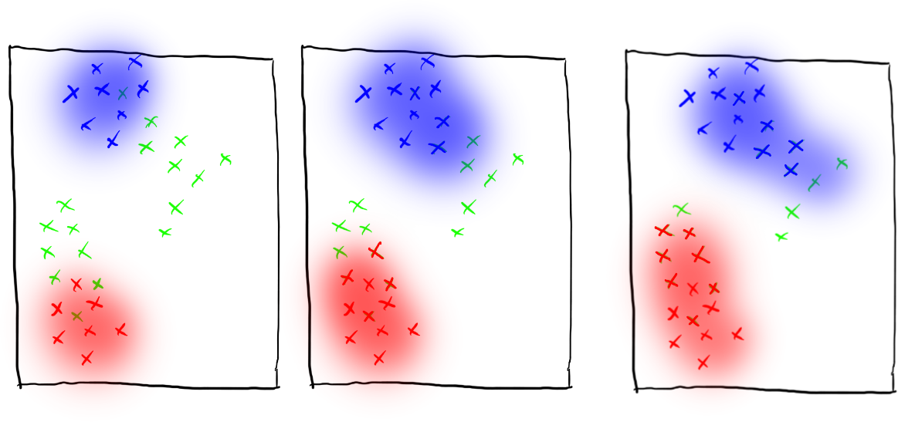
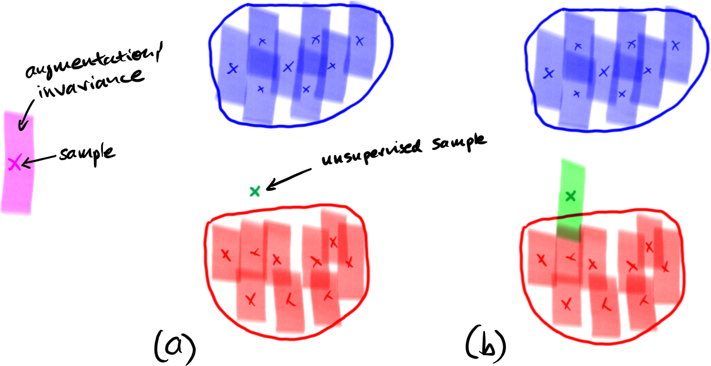
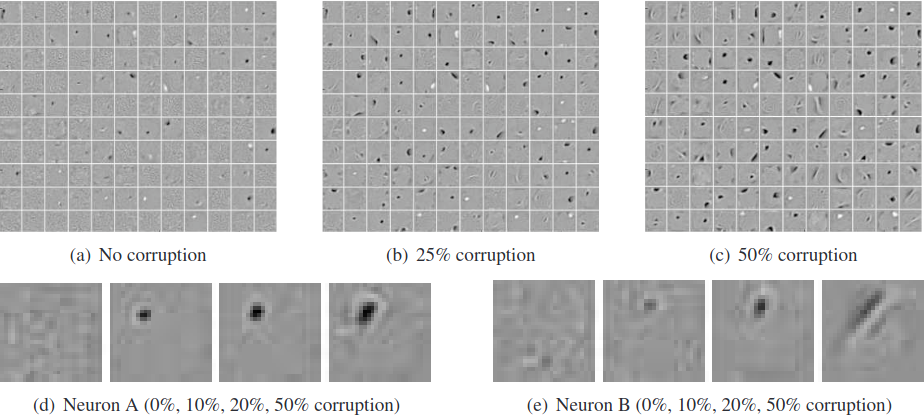
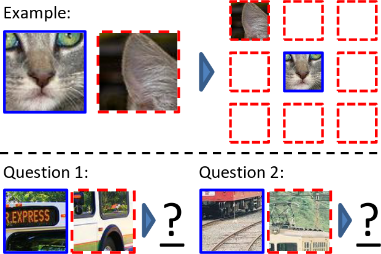
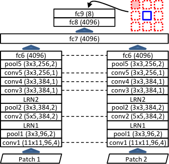
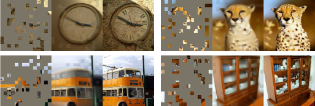
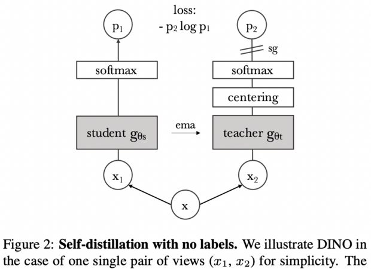
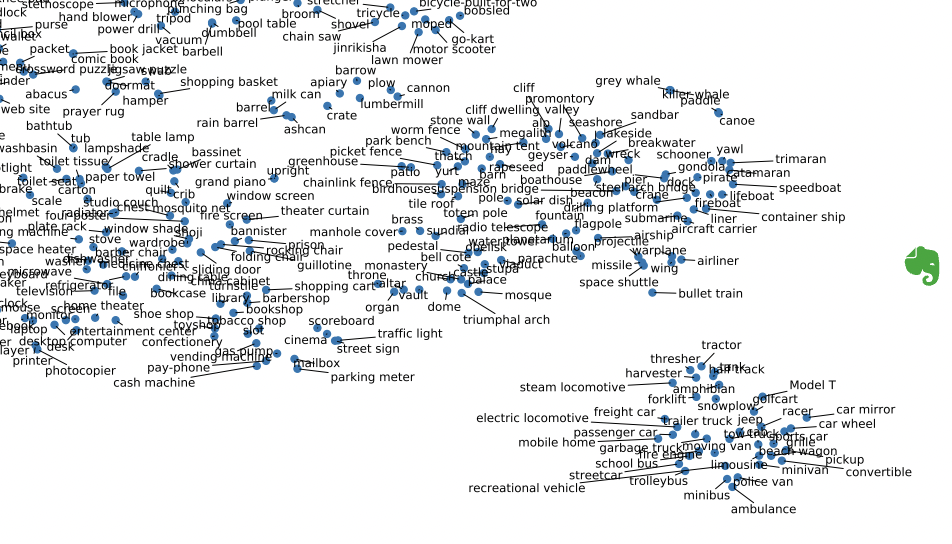

# SEMI-SUPERVISED LEARNING

# Semi-Supervised Learning

Two sets of training samples:

Labeled training samples:

$$(x, y) \sim p(x, y)$$

Much larger number of unlabeled samples:

$$x \sim p(x)$$

# Semi-Supervised Learning, Statistically

main method in computer vision:

- unsupervised pre-training and transfer learning

other methods:

- clustering and label-assignment to clusters
- prior knowledge about invariances
- supervised or unsupervised language models with EM training

Let's look at the "other methods" first then return to the first class of methods.

# Semi-Supervised Learning in the DL Literature

various ideas:

- augmentation and augmentation consistency
- entropy minimization
- pseudo-labeling, co-training, noisy student
- virtual adversarial training

# Pseudo-Labels Etc.

procedure:

- train classifier on labeled data
- use the classifier on unlabeled data to obtain pseudo-labeled training samples
- add pseudo-labeled training samples with high confidence to the training set
- repeat

# Pseudo-Labels Etc.

 

Labels "spread" to unlabeled samples based on similarity to labeled samples.

# Label Consistency with Data Augmentation

Data augmentation is a statement about _invariances_.

If $x' = g(x, z)$ (where $z$ is some random variable) is a useful data 
augmentation, we require that the objective doesn't change under the augmentation, 
i.e.,

$$P(c|x) \approx P(c|g(x, z))$$

# Label Consistency with Data Augmentation

# More Heuristics

- DL models are trained with SGD
- pseudo-labeled and augmented samples are often added "on the fly"
- there are various heuristics for doing this
    - "pi-model"
    - "temporal ensembling"
    - "mean teacher"
    - "virtual adversarial training"

# SELF-SUPERVISED LEARNING IN VISION

# Motivation

- humans and animals learn useful image representations without any labeled training data
- from both computer vision architectures and biological systems, we know that there are useful image representations / feature hierarchies
- image representations serve multiple purposes:
    - remove noise / irrelevant features
    - remain invariant under identity-preserving transformations
    - make decision boundaries easier to find

# Transfer Learning

- transfer learning for supervised training
    - train on ImageNet, replace head, retrain for CIFAR-100 / OCR / medical images
    - train on ImageNet, retrain for segmentation
- transfer learning with unsupervised pre-training
    - instead of a classification task, train on a self-supervised auxiliary task
    - completely analogous to what we have seen with language models like BERT

# Roadmap

We'll be looking at a number of approaches to self-supervised and representation learning in vision in historical order.

Historical order tends to introduce ideas in a fairly logical way (later papers build on earlier ones).

Focus in looking at these papers is primarily on the _self-supervised tasks_ not necessarily the details of the algorithms / architectures.

# Sequence Learning

GPT: autoregressive prediction yields models that solve classification and other tasks

BERT: masked predictions yields models that solve classification and other tasks

Can we do the same for computer vision?

# Why did it work for language?

Making good "next word" predictions often requires context and semantics:

Cf.

- "A giraffe has a very long _______."
- "A popular movie has a very long ______."

Try to engineer similar self-supervised tasks for vision.

# Approaches

- autoregressive image prediction
- masked image prediction
- other auxiliary tasks that benefit from semantic/class information

- pixel-level predictions
- patch-level predictions
- codebook-based predictions (discretize the image first with VQ)

# Autoregressive Image Prediction

Turn the image into a sequence:

- OCR: a sequence of left-to-right slices
- general image recognition: 
    - pixels in raster scan order
    - patches in raster scan order
    - VQ codebook entries in raster scan order

Properties:

- easy to do, though not necessarily a good model for images
- transformers+position embeddings = best of both worlds

# Masked Image Prediction

Idea:

- mask out part of the image
- fill in the masked part

Problem:

- difficult to do with convolutional networks
- much more successful with transformer-based approaches (later)

# Auxiliary Tasks

Observations:

- direct analogy to language models are prediction tasks $P(s_t | s_{t-1} ... s_1)$
- these are not all that natural for images
- we can instead choose other auxiliary tasks

Common auxiliary prediction tasks:

- predict color image from grayscale image
- predict depth from RGB or RGB from depth
- given two image patches, predict whether they come from the same image
- given two image patches, predict their spatial relationship

# Auxiliary Tasks

Good auxiliary tasks benefit from knowledge of object class / category.

E.g. grayscale $\rightarrow$ color: requires both segmentation and object class in general

# Autoencoders

- autoencoders learn identity functions
- they are usually used to discover a low-dimensional latent space
- important feature: bottleneck
- they reduce to PCA in the linear case
- tend not to learn interesting representations, in particular if latent space is too large

# Denoising Autoencoders

- reconstruct original $x$ by training an autoencoder on a noisy input signal $\nu(x)$ 
    - randomly zero out parts of $x$
    - add Gaussian noise
- loss: $||f(\nu(x)) - x||^2$ weighted by corruption mask
- similar to masking and corruption in BERT
# Denoising Autoencoder

Vincent et al. 2010

# Features Learned by Denoising Autoencoder

 

Vincent et al. 2010

# Denoising Autoencoder

- assume just a single linear layer
- training with zero noise $\approx$ PCA
- training with noise looks like some form of ICA or RICA
- details of the representation depend on the nature of the noise

# Stacked Denoising Autoencoder

Training

- incremental construction
    - train denoising autoencoder on $x$
    - compute latent representation for all $z$
    - repeat using $z$ as new $x$
- end-to-end training also possible

# Stacked Denoising Autoencoder

Transfer Learning

- no noise is added during inference
- compute all internal latent variables
- stack representations on top of each other
- incremental training of deep networks (pre-ReLU/batch norm!)

Use these representation to...

- directly with SVMs
- as input to a classification network

# Stacked Denoising Autoencoder: Problems

- lots of hyperparameters
    - convolutional vs linear
    - choices of noise type and magnitude
    - choice of loss function
    - number of hidden units
    - number of stacked encoders
- they can generate useful representations if the hyperparameters are right
- totally unsupervised training means we will not know whether the hyperparameters are right until we do transfer learning

# Masked Predictions

 

- Pathak et al. 2016
- down-convolutions + map + up-convolutions
- used for object recognition, segmentation

# Split-Brain Autoencoder

 

Zhang et al. 2016

# Using Split-Brain Autoencoder Features

 

Zhang et al. 2016

# Context Encoding

Doersch et al. 2016

# Context Encoding Architecture

 

Note the shared weights and similarity to Siamese networks.

Doersch et al. 2016

# Self-Supervised / Semi-Supervised so far

So far...

- many heuristic choices, difficult to tune and optimize
- transfer of learned representations from large datasets helps in some cases
- not competitive with supervised learning using _traditional_ architectures

Transformer architectures address many of these problems.
# VISION TRANSFORMERS

# Vision Transformers

Vision transformers are analogous to language transformers, using image patch embeddings instead of word embeddings. Dosovitskiy et al. 2020, arXiv:2010.11929

# Masked Autoencoder (MAE)

- inspired by BERT and inpainting
- uses Vision Transformers
- uses asymmetric encoder/decoder (lightweight decoder)
- used as pretraining for classifiers
- unlike BERT, no mask tokens are used/needed in encoder
- in the decoder, mask tokens represent missing patches

# Masked Autoencoder (MAE)

 

He et al. 2021

# Masked Autoencoder Reconstructions

 

He et al. 2021

# BEiT

BERT Pre-Training of Image Transformers

- directly inspired by BERT
- similar to MAE but more complex in detail
- uses tokenizer to transform patches into "word" tokens

# BEiT - Token-Based

 

Bao et al., 2022

# SimCLR - Contrastive Learning

Basic idea:

- generate two differently augmented versions of the same image
- train a representation that is as similar as possible for the same image, different for different images

Details:

- watch out for network findindg simplistic solutions (color)
- use pre-final output as representation
- compute "softmax over cosine similarity" over very large batches
- carefully choose augmentations

# SimCLR - Contrastive Learning

Chen et al., 2020; arXiv:2002.05709
# SimCLR - Augmentations

# SimCLR - Algorithm

# SimCLR - Transfer Learning Performance

# DINO

- self-DIstillation with NO labels
- unsupervised representation learning for images
- manages to learn semantic segmentation and semantic representations
- attention map = segmentation map
- $k$-nn and linear classifiers work well on representation
- can be used with different architectures
    - 8x8 patches vision transformer
    - ResNet 50

# DINO Architecture

# DINO Architecture

- output is made to look like a distribution, class-like
- two different augmentations must yield the same class
- using a Siamese approach would lead to mode collapse
- instead, use a "student-teacher" approach
- "teacher" is actually just exponentially moving average of student
- "centering" = subtract running average of teacher output
- softmax uses temperature parameter, much lower for teacher ("sharpening")
- student augmentations are a mix of small and large patches, teacher is always large patches (easier problem)

# DINO High Level

- architecture encourages the system to assign classes to images
- classes are latent
- ordinarily, would use EM algorithm to do this
- DINO achieves this via student-teacher, centering, softmax

Prior assumptions:

- dataset is constructed to have a single prominent object
- this is represented in the softmax/centering of the output

# DINO Pseudocode

# DINO Results

# DINO Segmentation

- semantic segmentation by attention looks better than from supervised models

# DINO Object Semantics from Vision

- DINO visual representations gives map to meaningful semantic maps (t-SNE)

# Summary of Self-Supervised Learning in Vision

Covers:

- semi-supervised learning
- representation learning
- transfer learning
# Summary of General Approach

- predict masked portions of images
- predict relations between patches
- contrastive learning under data augmentations
- purely postiive learning using "student teacher"

# How general are these?

There are hidden assumptions:

- learning under data augmentations = assumptions about invariances
- "student-teacher" style models = assumes single class per image
- masked autoencoder = assumption about predictable local relationships between object appearances

Conclusions:

- similar to NLP, large amounts of unlabeled data may soon obviate the need for a lot of training
- MAE/BERT-like approach is probably the most general
- video+MAE may end up being sufficient without a lot of other prior assumptions

# Combining Image and Text Models

Transformer-based architectures and unsupervised pretraining naturally combine:
- unsupervised pre-training of vision transformers
- unsupervised pre-training of text transformers
- learn mapping from vision transformer to text transformer
    - e.g., semi-supervised using image captioning data
Yields:
- captioning
- visual question answering
- zero shot recognition
Synergy between massive unlabeled image and text datasets and pretrained models.
